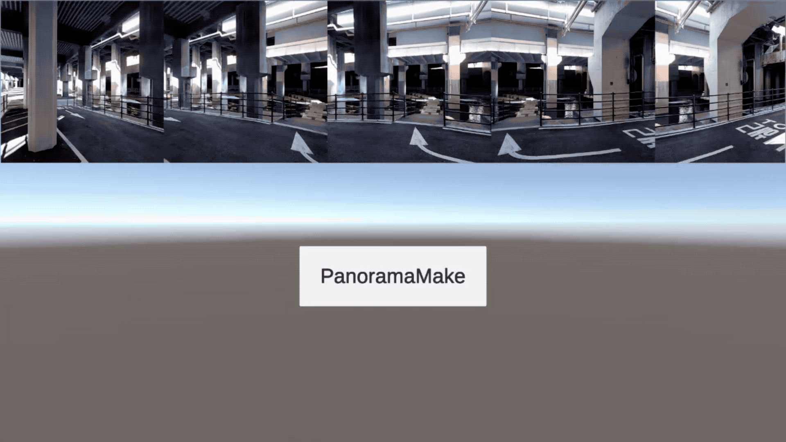

# Panorama Photo Maker - Unity Android Guide
Panorama Photo Maker is the unity plugin that helps you make panorama picture easily on Unity Android.
This Asset stitches your pictures and then creates a large big one picture
 
This Plugin provides a C# interface for stitching photoes

This Asset only supports Android Platform.
- Only Support Android 8.0(API Level 26) Above
- Only Support ARM64 Architecture Device

## Documentation
The [developer guide](https://github.com/DevCoop-code/PanoramaPhotoMaker-Unity/tree/master/DeveloperGuide) provides a STTS API information

## Suggesting improvements
To find bugs, make feature requests, or to suggest other improvements, please use [github's issue tracker](https://github.com/DevCoop-code/PanoramaPhotoMaker-Unity/issues)

## Download
Asset Store: https://assetstore.unity.com/packages/slug/212443 